# 🎭 ARG — A Birita Desaparecida
## Projeto Completo Criado com Sucesso! ✅

---

## 📦 Estrutura Final do Projeto

### Nova lore

A birita principal desapareceu pouco antes da festa. As equipes seguem pistas pelas páginas, locais, bibliotecas e Instagram até encontrar a garrafa. A frase-chave correta abre o open bar e libera a garrafa-prêmio. O consumo é opcional, somente para adultos, com alternativas sem álcool, água e transporte seguro.

```
📁 arg/
│
├── 📄 index.html                          ← SITE A: Portal de entrada
│
├── 📁 equipes/                            ← SITE B: Páginas das 6 equipes
│   ├── azul.html                          (coordenadas escondidas no código)
│   ├── verde.html                         (coordenadas escondidas no código)
│   ├── amarela.html                       (coordenadas escondidas no código)
│   ├── roxa.html                          (coordenadas escondidas no código)
│   ├── laranja.html                       (coordenadas escondidas no código)
│   └── vermelha.html                      (coordenadas escondidas no código)
│
├── 📁 biblioteca/                         ← SITE C: Bibliotecas das 3 duplas
│   ├── dupla1.html                        (Azul + Verde)
│   ├── dupla2.html                        (Amarela + Roxa)
│   └── dupla3.html                        (Laranja + Vermelha)
│
├── 📁 final/                              ← SITE D: Notebook final
│   └── notebook.html                      (frase-chave + revelação)
│
├── 📁 assets/                             ← Arquivos compartilhados
│   ├── config.js                          ⚠️ EDITAR ESTE ARQUIVO ANTES DO EVENTO
│   └── style.css                          (estilos globais)
│
├── 📁 documentation/                      ← Documentação original
│   └── INSTRUCTIONS.md
│
├── 📄 README.md                           📖 Documentação completa
├── 📄 GUIA-RAPIDO-EVENTO.md              📋 Guia para imprimir (dia do evento)
└── 📄 CARTOES-POSTAIS-TEMPLATE.html      🎨 Template para impressão dos cartões

```

---

## ✅ O Que Foi Criado

### 🌐 Sites (Todos funcionais)

#### 1. **Portal de Entrada** (`index.html`)
- Campo para digitar código secreto
- Valida e redireciona para página da equipe
- Mensagem de erro se código inválido

#### 2. **6 Páginas de Equipes** (`equipes/*.html`)
- Uma por cor: Azul, Verde, Amarela, Roxa, Laranja, Vermelha
- Coordenadas GPS escondidas no código-fonte (variações entre comentários HTML e atributos `data-*`)
- Pista visual sutil indicando que devem inspecionar o código

#### 3. **3 Páginas de Biblioteca** (`biblioteca/*.html`)
- Lista de 15 autores brasileiros clicáveis
- Apenas 1 autor por dupla revela o Instagram
- Modal com link abrindo em nova aba

#### 4. **Notebook Final** (`final/notebook.html`)
- Campo único para frase-chave
- Validação ignorando maiúsculas e acentos
- Revelação final com efeito de confete 🎉

### 📋 Documentação

#### 1. **README.md** — Documentação Completa
- Instruções de configuração
- Como editar o `config.js`
- Guia de hospedagem (GitHub Pages, Netlify, Vercel)
- Solução de problemas
- Checklist de testes

#### 2. **GUIA-RAPIDO-EVENTO.md** — Para Imprimir
- Tabelas para preencher (códigos, coordenadas, autores)
- Dicas graduais por etapa
- Problemas técnicos comuns
- Timeline estimada
- Checklist pré-evento

#### 3. **CARTOES-POSTAIS-TEMPLATE.html** — Para Impressão
- 6 cartões estilizados (um por equipe)
- Design temático com cores das equipes
- Pronto para editar e imprimir

### 🎨 Assets

#### 1. **config.js** — Arquivo Central de Configuração ⚠️
**Este é o ÚNICO arquivo que você precisa editar!**

```javascript
const ARG_CONFIG = {
  codigos: { ... },           // Códigos secretos das 6 equipes
  coordenadas: { ... },       // Coordenadas GPS dos pontos de partida
  duplas: { ... },            // Autores-chave e links do Instagram
  autoresBiblioteca: [...],   // Lista de 15 autores
  fraseChaveFinal: "...",     // Frase-chave do final
  mensagemFinal: "..."        // Mensagem de encerramento
};
```

#### 2. **style.css** — Estilos Globais
- Paleta de cores temáticas (mistério/investigação)
- Cores das 6 equipes definidas
- Responsive design (mobile-friendly)
- Animações (confete, modal, etc.)

---

## 🚀 Próximos Passos

### 1️⃣ **EDITAR CONFIGURAÇÕES** (Obrigatório)

Abra o arquivo `assets/config.js` e preencha:

- [ ] **Códigos secretos** das 6 equipes (ex: `"CODIGOAZUL"`)
- [ ] **Coordenadas GPS** dos 6 pontos de partida (formato: `"latitude,longitude"`)
- [ ] **Autores-chave** das 3 duplas (devem estar na lista de autores)
- [ ] **Links do Instagram** das 3 duplas (criar as contas primeiro)
- [ ] **Frase-chave final** (mesma para todas as equipes)
- [ ] **Mensagem de encerramento** (texto que aparece ao acertar)

### 2️⃣ **TESTAR LOCALMENTE**

```bash
# Opção 1: Abrir diretamente
# Clique duas vezes em index.html

# Opção 2: Usar servidor local
# Com Python:
python -m http.server 8000

# Com Node.js:
npx serve

# Acesse: http://localhost:8000
```

### 3️⃣ **HOSPEDAR O SITE**

Escolha uma das opções:

#### 🟢 **GitHub Pages** (Recomendado - Grátis)
1. Crie um repositório no GitHub
2. Faça upload de todos os arquivos
3. Vá em Settings > Pages
4. Selecione branch main e pasta root
5. Aguarde deploy (URL: `https://usuario.github.io/repo`)

#### 🟣 **Netlify** (Mais Fácil - Grátis)
1. Acesse [netlify.com](https://netlify.com)
2. Arraste a pasta inteira no site
3. Pronto! URL gerada automaticamente

#### 🔵 **Vercel** (Rápido - Grátis)
1. Acesse [vercel.com](https://vercel.com)
2. Importe do GitHub ou faça upload
3. Deploy automático

### 4️⃣ **PREPARAR MATERIAIS FÍSICOS**

- [ ] Editar e imprimir `CARTOES-POSTAIS-TEMPLATE.html` (6 cartões)
- [ ] Preparar enigmas físicos nos locais indicados pelas coordenadas
- [ ] Preparar quebra-cabeças físicos para as duplas
- [ ] Criar e postar fotos nos 3 Instagrams das duplas
- [ ] Preparar malas físicas com dossiês

### 5️⃣ **TESTAR TUDO** (1 dia antes)

Use o checklist do `README.md`:

- [ ] Site está acessível online
- [ ] Todos os 6 códigos funcionam
- [ ] Coordenadas aparecem no código-fonte de cada página de equipe
- [ ] Coordenadas abrem o local correto no Google Maps
- [ ] Autores-chave revelam os links do Instagram
- [ ] Links do Instagram abrem corretamente
- [ ] Frase-chave funciona no notebook final
- [ ] Testado em celular (Chrome e Safari)

### 6️⃣ **IMPRIMIR GUIA RÁPIDO**

Imprima `GUIA-RAPIDO-EVENTO.md` e preencha as tabelas com:
- URL do site
- Códigos das equipes
- Coordenadas (para conferência)
- Autores-chave
- Frase-chave final

---

## 🎯 Fluxo Completo do Jogo — A Birita Desaparecida

> O fluxo abaixo inclui os caminhos felizes **e** os caminhos de contingência: tentativas erradas, timeouts de demora e falhas externas (internet, Instagram, site fora do ar). Toda etapa arriscada tem uma saída de resgate operada pelo monitor, para que nenhuma equipe fique travada por muito tempo.

```mermaid
%%{ init: { 'flowchart': { 'curve': 'stepAfter', 'nodeSpacing': 45, 'rankSpacing': 70, 'diagramPadding': 10 } } }%%
flowchart TD
  A[Cartão-postal físico<br/>Cada equipe recebe um código único] --> B[Site A: Portal de entrada<br/>index.html]
  A -.->|Cartão perdido/ilegível| A1[Monitor consulta backup impresso<br/>do GUIA-RAPIDO-EVENTO.md] -.-> B

  B --> C{Código válido?}
  C -->|Não| B1[Mensagem de erro<br/>Código não reconhecido] --> B
  C -->|"3+ tentativas erradas"| B2[Monitor confirma o código<br/>no guia impresso] --> B
  B -.->|Site fora do ar / sem internet| BZ[Monitor usa cópia offline<br/>do site salva em pendrive/celular] -.-> C
  C -->|Sim| D{Equipe identificada}

  D --> E1[Equipe Azul<br/>equipes/azul.html]
  D --> E2[Equipe Verde<br/>equipes/verde.html]
  D --> E3[Equipe Amarela<br/>equipes/amarela.html]
  D --> E4[Equipe Roxa<br/>equipes/roxa.html]
  D --> E5[Equipe Laranja<br/>equipes/laranja.html]
  D --> E6[Equipe Vermelha<br/>equipes/vermelha.html]

  subgraph SG_G[Encontrar coordenadas da birita — 6 equipes]
    G1[Azul: código-fonte]
    G2[Verde: código-fonte]
    G3[Amarela: código-fonte]
    G4[Roxa: código-fonte]
    G5[Laranja: código-fonte]
    G6[Vermelha: código-fonte]
  end

  E1 --> G1
  E2 --> G2
  E3 --> G3
  E4 --> G4
  E5 --> G5
  E6 --> G6

  SG_G -.->|"+15 min sem achar"| GT[Monitor dá dica gradual<br/>leve → média → forte]
  GT -.-> SG_G

  G1 --> H1[Google Maps<br/>Ponto de partida Azul]
  G2 --> H2[Google Maps<br/>Ponto de partida Verde]
  G3 --> H3[Google Maps<br/>Ponto de partida Amarela]
  G4 --> H4[Google Maps<br/>Ponto de partida Roxa]
  G5 --> H5[Google Maps<br/>Ponto de partida Laranja]
  G6 --> H6[Google Maps<br/>Ponto de partida Vermelha]

  subgraph SG_I[Locais físicos — pontos de partida]
    I1[Local físico Azul]
    I2[Local físico Verde]
    I3[Local físico Amarela]
    I4[Local físico Roxa]
    I5[Local físico Laranja]
    I6[Local físico Vermelha]
  end

  H1 --> I1
  H2 --> I2
  H3 --> I3
  H4 --> I4
  H5 --> I5
  H6 --> I6
  SG_I -.->|GPS falhou / sem sinal| HZ[Coordenadas impressas<br/>de backup no guia do evento]
  HZ -.-> SG_I

  subgraph SG_J[Enigma físico — 6 equipes]
    J1[Enigma físico Azul]
    J2[Enigma físico Verde]
    J3[Enigma físico Amarela]
    J4[Enigma físico Roxa]
    J5[Enigma físico Laranja]
    J6[Enigma físico Vermelha]
  end

  I1 --> J1
  I2 --> J2
  I3 --> J3
  I4 --> J4
  I5 --> J5
  I6 --> J6
  SG_J -.->|"+20 min travados"| JT[Monitor de plantão no local<br/>libera dica ou próxima etapa]
  JT -.-> SG_J

  J1 --> K1[Novo local físico<br/>Quebra-cabeças da Dupla 1]
  J2 --> K1
  J3 --> K2[Novo local físico<br/>Quebra-cabeças da Dupla 2]
  J4 --> K2
  J5 --> K3[Novo local físico<br/>Quebra-cabeças da Dupla 3]
  J6 --> K3

  K1 --> L1[Site C: Biblioteca Dupla 1<br/>Azul + Verde]
  K2 --> L2[Site C: Biblioteca Dupla 2<br/>Amarela + Roxa]
  K3 --> L3[Site C: Biblioteca Dupla 3<br/>Laranja + Vermelha]

  subgraph SG_M[Autor-chave encontrado?]
    M1{Dupla 1}
    M2{Dupla 2}
    M3{Dupla 3}
  end

  L1 --> M1
  L2 --> M2
  L3 --> M3
  M1 -->|Não| L1
  M2 -->|Não| L2
  M3 -->|Não| L3
  SG_M -.->|"+10 min sem achar o autor"| MT[Monitor revela<br/>o autor-chave diretamente]
  MT -.-> SG_M

  subgraph SG_N[Instagram das duplas]
    N1[Instagram da Dupla 1]
    N2[Instagram da Dupla 2]
    N3[Instagram da Dupla 3]
  end

  M1 -->|Sim| N1
  M2 -->|Sim| N2
  M3 -->|Sim| N3
  SG_N -.->|Perfil indisponível/privado| NZ[Monitor mostra impressão<br/>dos posts salvos em PDF]
  NZ -.-> SG_N

  N1 --> O[Fotos com pistas<br/>Dígitos escondidos]
  N2 --> O
  N3 --> O
  O -.->|"+15 min sem achar a mala"| OT[Monitor aponta o local exato<br/>da mala física]
  OT -.-> P
  O --> P[Mala física<br/>Dossiê da birita + vídeo + frase-chave]
  P --> Q[Site D: Notebook final<br/>final/notebook.html]
  Q --> R{Frase-chave correta?}
  R -->|Não| Q1[Mensagem de tentativa incorreta] --> Q
  R -->|"5+ tentativas erradas"| Q2[Monitor confirma a grafia exata<br/>da frase no guia impresso] --> Q
  R -->|Sim| S[Revelação final<br/>Open bar liberado + garrafa-prêmio + confete]

  %% Preenchimento = tipo de etapa | Borda = status da implementação
  classDef digitalDone fill:#6C63FF,color:#fff,stroke:#238636,stroke-width:4px;
  classDef digitalPending fill:#6C63FF,color:#fff,stroke:#D29922,stroke-width:4px,stroke-dasharray: 6 4;
  classDef physicalDone fill:#38B2AC,color:#fff,stroke:#238636,stroke-width:4px;
  classDef physicalPending fill:#38B2AC,color:#fff,stroke:#DA3633,stroke-width:4px,stroke-dasharray: 6 4;
  classDef decisionDone fill:#E0E5EC,color:#3D4852,stroke:#238636,stroke-width:3px;
  classDef decisionPending fill:#E0E5EC,color:#3D4852,stroke:#D29922,stroke-width:3px,stroke-dasharray: 6 4;
  classDef error fill:#E0E5EC,color:#C53030,stroke:#DA3633,stroke-width:3px;
  classDef assist fill:#FFF3CD,color:#7A5C00,stroke:#D29922,stroke-width:3px,stroke-dasharray: 3 3;
  classDef success fill:#E0E5EC,color:#237a72,stroke:#238636,stroke-width:3px;

  %% Etapas digitais já implementadas no projeto
  class B,E1,E2,E3,E4,E5,E6,G1,G2,G3,G4,G5,G6,H1,H2,H3,H4,H5,H6,L1,L2,L3,M1,M2,M3,Q digitalDone;
  class C,D,R decisionDone;
  class SG_G digitalDone;
  class SG_M decisionDone;

  %% Etapas digitais externas ou que ainda exigem configuração
  class N1,N2,N3,O digitalPending;
  class SG_N digitalPending;

  %% Etapas físicas ainda dependentes da organização do evento
  class A,I1,I2,I3,I4,I5,I6,J1,J2,J3,J4,J5,J6,K1,K2,K3,P physicalPending;
  class SG_I,SG_J physicalPending;

  class B1,Q1 error;

  %% Redundâncias: resgates de erro e de demora operados pelo monitor
  class A1,B2,BZ,GT,HZ,JT,MT,NZ,OT,Q2 assist;

  class S success;

  %% Legenda
  subgraph LEGENDA[Legenda]
    LD[Digital concluído]
    LP[Digital pendente]
    FD[Físico concluído]
    FP[Físico pendente]
    LA[Resgate de erro ou demora<br/>ação do monitor]
  end
  class LD digitalDone;
  class LP digitalPending;
  class FD physicalDone;
  class FP physicalPending;
  class LA assist;
```



### 🛟 Resumo das redundâncias adicionadas

| Ponto do fluxo | Risco | Redundância |
|---|---|---|
| Cartão-postal | Cartão perdido ou ilegível | Monitor confere o código no guia impresso |
| Portal de entrada | Código digitado errado repetidamente | Após 3 tentativas, monitor confirma o código |
| Portal de entrada | Site fora do ar / sem internet | Cópia offline do site em pendrive/celular |
| Página da equipe | Mais de 15 min sem achar a coordenada | Dicas graduais (leve → média → forte) |
| Google Maps | GPS falhou ou sem sinal | Coordenadas impressas de backup |
| Enigma físico | Mais de 20 min travados no local | Monitor de plantão libera dica ou a próxima etapa |
| Biblioteca de autores | Mais de 10 min sem achar o autor-chave | Monitor revela o autor-chave diretamente |
| Instagram da dupla | Perfil indisponível ou privado | Impressão em PDF dos posts como backup |
| Mala física | Mais de 15 min sem encontrar a mala | Monitor aponta o local exato |
| Notebook final | 5+ tentativas com a frase errada | Monitor confirma a grafia exata da frase |

Esses resgates evitam que uma falha técnica ou um enigma difícil pare o jogo por completo, mantendo o ritmo da festa até a abertura do open bar.

---

## 🛠️ Tecnologias Utilizadas

- **HTML5** — Estrutura semântica
- **CSS3** — Estilos e animações (gradientes, keyframes, grid)
- **JavaScript Vanilla** — Lógica interativa (sem frameworks)
- **Google Maps** — Para coordenadas GPS
- **Instagram** — Para camada social do ARG

**Características:**
- ✅ 100% estático (sem backend, sem build)
- ✅ Funciona offline após carregar
- ✅ Mobile-friendly (responsive design)
- ✅ Cross-browser (Chrome, Safari, Firefox, Edge)
- ✅ Um único arquivo de configuração centralizado

---

## 📊 Estatísticas do Projeto

- **Total de arquivos:** 16
- **Total de páginas HTML:** 12
  - 1 portal de entrada
  - 6 páginas de equipes
  - 3 páginas de biblioteca
  - 1 notebook final
  - 1 template de cartões
- **Linhas de código:** ~2.500+
- **Tempo estimado do jogo:** 2-3 horas
- **Número de jogadores:** 60 (6 equipes de 10)

---

## 🎨 Paleta de Cores

| Equipe  | Hex Code | Emoji |
|---------|----------|-------|
| Azul    | #2E75B6  | 🔵    |
| Verde   | #38761D  | 🟢    |
| Amarela | #F1C232  | 🟡    |
| Roxa    | #674EA7  | 🟣    |
| Laranja | #E69138  | 🟠    |
| Vermelha | #C0392B | 🔴    |
| Vermelho (lore) | #8b0000 | 🔴 |

---

## 💡 Dicas para o Dia do Evento

1. **Tenha um backup offline:** Baixe todo o site em ZIP antes do evento
2. **Teste a internet na chácara:** Se for instável, considere servidor local
3. **Prepare dicas graduais:** Nem todos os jogadores são técnicos
4. **Monitore o progresso:** Use o guia rápido para acompanhar cada equipe
5. **Celebre o final:** A mensagem de encerramento é personalizável!

---

## 🎉 Pronto para Jogar!

**Seu ARG está completo e funcional!** 🎊

Tudo que você precisa fazer agora é:
1. Editar `assets/config.js` com seus dados
2. Hospedar o site
3. Imprimir os cartões-postais
4. Preparar os enigmas físicos
5. Criar as contas do Instagram
6. Testar tudo 1 dia antes

**Boa sorte com a gincana! Que a birita seja encontrada e o open bar seja liberado!** 🍾

---

*Projeto criado com ❤️ para uma gincana épica de 60 pessoas*
